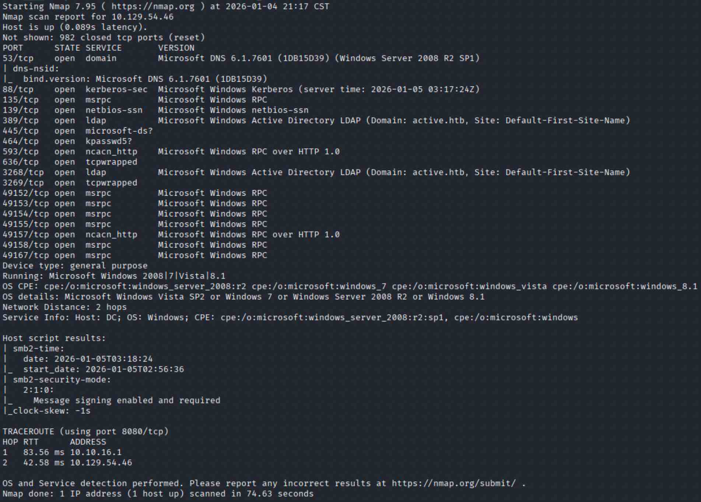
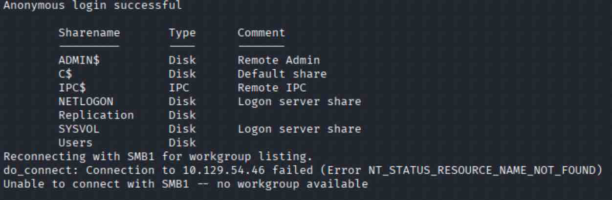
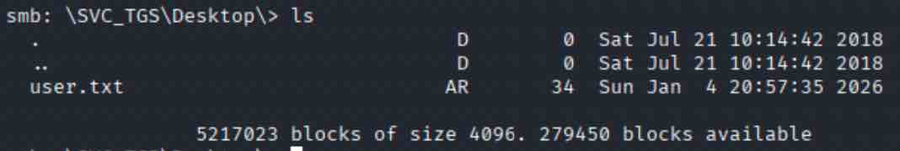
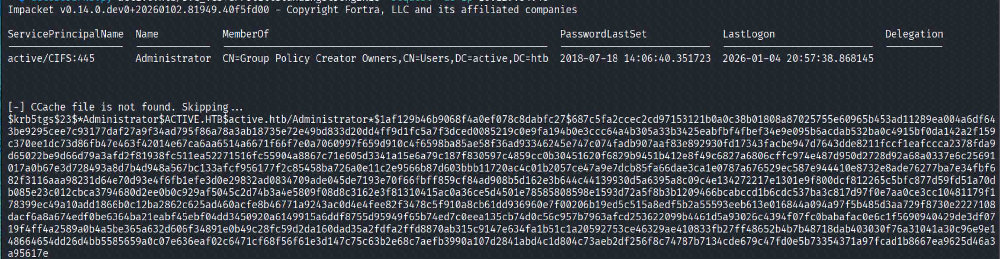
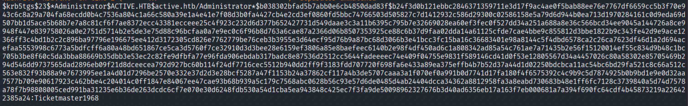

# Enumeration

Starting out I knew this box was going to probably be an AD/Windows box due to the name and description, so I ran an initial nmap scan to see what ports/services the box had to offer.
## nmap
``` bash
sudo nmap -Pn -A -T4 HOST -oA initial.HOST
```

Upon reviewing our scan results I see that we are potentially dealing with a windows server 2008 that of course is severely outdated. Usually when I work on a windows machine anonymous smb authentication is where I like to begin probing.

## SMB
I try authenticating anonymously to SMB and find we have access to a particularly interesting share
``` bash
smbclient -L //IP/ -N
```

After listing all shares the "Replication" share is of interest, so I again, try to authenticate anonymously and establish a session on the share.

``` bash
smbclient //IP/Replication -N -c "recurse; ls"
```
.png)

After a bit of time looking and my eyes beginning to burn, I noticed the "Groups.xml" file that seems to be of interest. While in an active smbclient session I ran `get \active.htb\Policies\{31B2F340-016D-11D2-945F-00C04FB984F9}\MACHINE\Preferences\Groups\Groups.xml` to download the file to my local kali machine. 

Once we take a look at the newly downloaded file I was able to identify some credentials, so I took them and threw them into a "creds.txt" file to track all the creds I obtain while attacking the "Active" machine. From there I remember that port 88 - Kerberos is open so I then move on to try and attack it.

# Exploitation - GPP Credential Abuse
## User.txt
Before we move into more post-exploitation I went back to smbclient and authenticated with the new user credentials.
``` bash
smbclient //10.129.54.46/Users -U active.htb/SVC_TGS --password=PASSWORD
```

# Post-Exploitation
Once I established the session I went into the SVC_TGS users Desktop to retrieve the user.txt file and got the flag.


## Kerberoasting
I then use impackets "GetUserSPNs.py" to attack Kerberos to see if I can retrieve any SPN attached to user accounts.
``` bash
GetUserSPNs.py DOMAIN\USER:PASSWORD -request -dc-ip DC IP
```


The kerberoasting attack was successful and we were able to query the DC Admin account that we can now take offline and crack with hashcat. I threw this into "krb.txt" and moved on to password cracking. Always Be Cracking!

## Password Cracking w/ Hashcat
``` bash
hashcat -m 13100 krb.txt /usr/share/wordlists/rockyou.txt
```

After a successful run with hashcat I was able to identify the Admin accounts password. The next and last logical step was to login via smbclient and grab the root.txt file. 

## root.txt
``` bash
smbclient //IP/Users -U active.htb/Administrator --password=PASSWORD
```
Lastly now that I established an active session I navigated to the Administrator directory, grabbed the root flag and pwnd "Active"! Happy Hacking!

